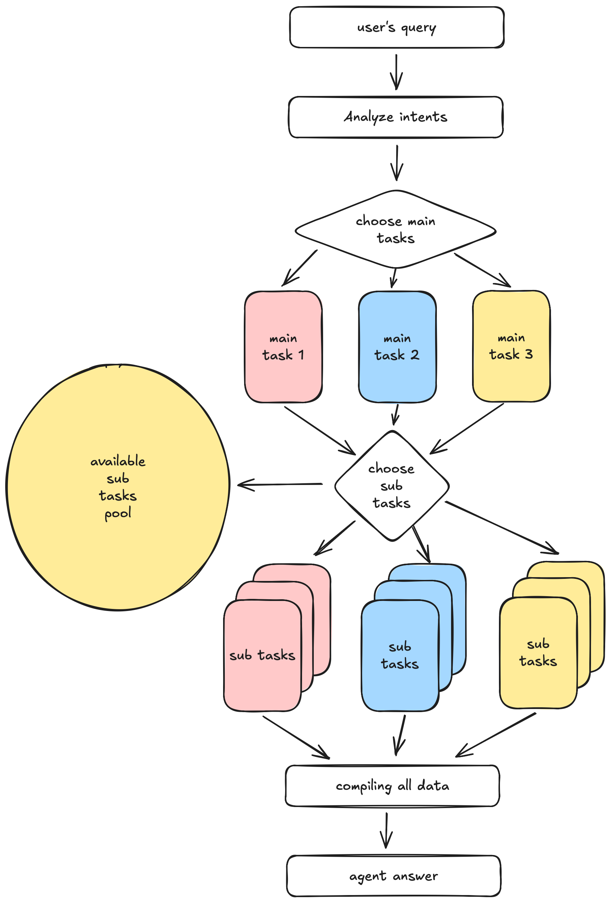

# RIOT-AGENT

🤖 Agent for League of Legends.

---

## English

### 📜 Project Description
`RIOT-AGENT` is an automated agent designed for retrieving and analyzing data from the popular online game, League of Legends. It aims to provide essential information such as player stats, match history, and champion details to support data-driven decision-making and insights.

### 🦜 Features
- Retrieve player (summoner) information
- Access champion statistics and abilities
- Fetch recent match history and details
- Analyze ranked performance and leaderboard standings
- Gather in-game item details for enhanced strategies

### ⚙️ How it Works?

1. Get query's intent.
2. Plan main tasks depending on it's intent.
3. In main tasks, **dynimacally plan sub tasks.**
4. Compiling all data driven from each task, and preprocess for final agent answer.
5. Get final answer from agent.

### 📝 Dynamical Planning

Dynamical Planning is that agent chooses functions in tasks pool.
There are conditions to achieve this.

- Each task function **MUST RETURN VOID** and **HAVE FIXED INPUT PARAMETERS**
Since LLM-based agent can't decide precisely input parameters and return value, we must let agent choose funtions only.

- Each task function **MUST HAVE ITS DOCSTRING**
Docstrings is best way to let LLM know what functions do.
In our example, we try LLM first, if exception raises, similarity search for docstring.
